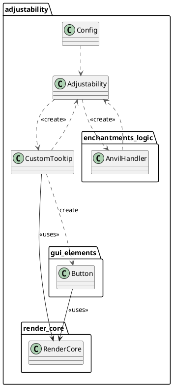

# Structural/Name Only Class Diagram

```plantuml
@startuml
top to bottom direction
package adjustability
{
class Adjustability
package enchantments_logic
{
class AnvilHandler
}

class Config

package render_core
{

class RenderCore
}
  package gui_elements{
class Button 
}
class CustomTooltip
}

Adjustability  -[#595959,dashed]->  AnvilHandler  : <<create>>

Adjustability  -[#595959,dashed]->  CustomTooltip : <<create>>

AnvilHandler   -[#595959,dashed]->  Adjustability

Config         -[#595959,dashed]->  Adjustability

CustomTooltip  -[#595959,dashed]->  Adjustability

CustomTooltip  -->  RenderCore : <<uses>>
CustomTooltip --[#595959,dashed]-> Button : "«create»"
Button --> RenderCore : <<uses>>
@enduml
```